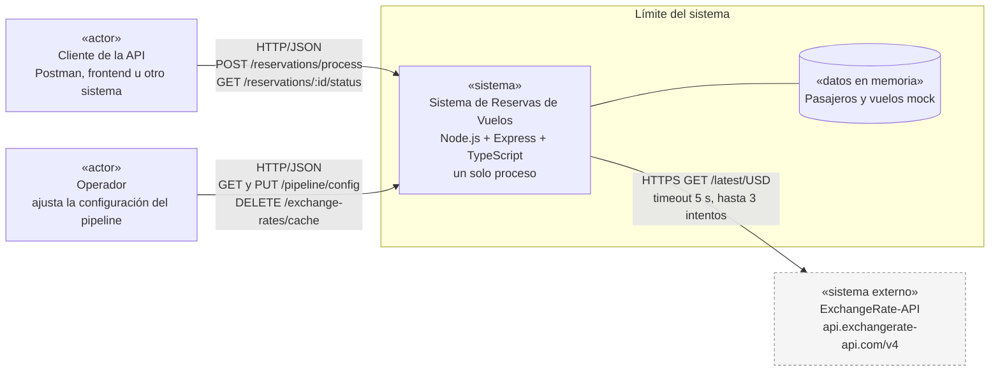

# 01. Diagrama de contexto

El diagrama de contexto no es una vista estructural en sí, sino parte de la documentación que va más allá de las vistas. Sirve para marcar el alcance del sistema antes de entrar en su estructura interna: qué queda adentro, qué queda afuera y cómo se comunican.

## 1. Representación primaria

## 2. Catálogo de elementos

| Elemento | Tipo | Responsabilidad | Interfaz |
|---|---|---|---|
| Cliente de la API | Actor | Envía lotes de reservas para procesar y consulta su estado | `POST /reservations/process`, `GET /reservations/:id/status` |
| Operador | Actor | Consulta y modifica qué filtros están habilitados y con qué parámetros. Puede invalidar la caché de tasas | `GET /pipeline/config`, `PUT /pipeline/config`, `DELETE /exchange-rates/cache` |
| Sistema de Reservas de Vuelos | Sistema bajo diseño | Valida, enriquece y calcula el costo final de cada reserva mediante un pipeline de filtros | API REST en JSON |
| Pasajeros y vuelos mock | Datos en memoria | Simulan la base de datos. Se cargan al iniciar la aplicación | Módulos TypeScript en `src/data` |
| ExchangeRate-API | Sistema externo | Informa las tasas de cambio actuales tomando USD como moneda base | `GET https://api.exchangerate-api.com/v4/latest/USD`, sin autenticación |

En la práctica el cliente y el operador pueden ser la misma persona usando Postman. Se separan porque usan partes distintas de la API y tienen intereses distintos.

El endpoint `DELETE /exchange-rates/cache` no figura en la lista de la letra. Se agrega para cubrir el pedido de invalidación manual de la caché de tasas.

## 3. Guía de variabilidad

- **Proveedor de tipo de cambio.** La URL base se define con la variable de entorno `EXCHANGE_API_BASE_URL`. Para cambiar a Fixer, CurrencyAPI u Open Exchange Rates hay que escribir otro adaptador, como se explica en la vista de módulos.
- **Datos mock.** Se editan en `src/data` para armar distintos escenarios de prueba.
- **Puerto de escucha.** Se configura con la variable `PORT`.

## 4. Decisiones de arquitectura

### 4.1 Justificación

Se eligió ExchangeRate-API porque es la única de las cuatro sugeridas que no pide clave, tiene el límite gratuito más alto y en una sola respuesta devuelve todas las tasas para una moneda base. Como todos los precios base están en USD, alcanza con una llamada por hora para todo el sistema. El detalle está en el [ADR-002](../adr/ADR-002-resiliencia-api-tipo-de-cambio.md).

### 4.2 Resultados de análisis

Con una caché de una hora el consumo máximo es de unas 24 llamadas por día, alrededor de 720 por mes. Eso queda por debajo del límite gratuito de 1.500.

### 4.3 Supuestos y restricciones

- **Un solo proceso.** El sistema corre en un único proceso de Node.js sin base de datos, así que la configuración, la caché y los estados se pierden al reiniciar. La letra lo acepta porque pide datos mock en memoria.
- **Sin autenticación.** No hay usuarios ni permisos, porque la letra no lo pide.
- **Precios base en USD.** Todos los precios base están en USD, como indica la letra.

## 5. Vistas relacionadas

- [02 Componentes y Conectores](02-componentes-y-conectores.md) muestra qué pasa adentro del límite del sistema.
- [04 Comportamiento](04-comportamiento.md) muestra la interacción con ExchangeRate-API paso a paso.
