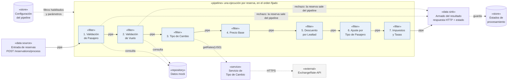
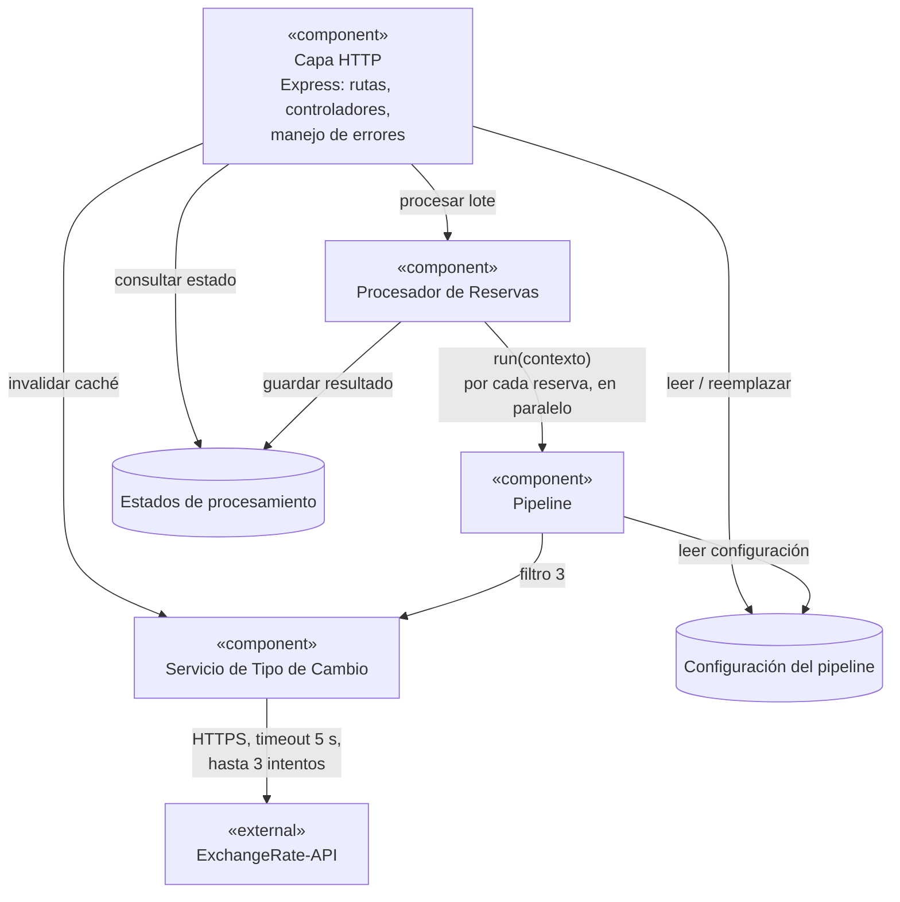
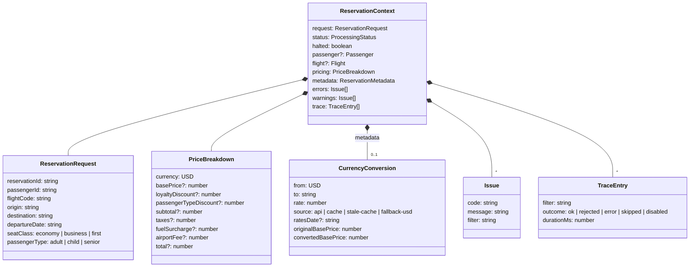

# 02. Vista de Componentes y Conectores

Estilo: Pipes and Filters.

Esta es la vista principal del sistema. Pipes and Filters es un patrón de tiempo de ejecución: los filtros son componentes, las unidades que procesan datos, y los pipes son conectores, el medio por el que los datos pasan de un filtro al siguiente. Por eso la vista que mejor lo muestra es la de componentes y conectores, que responde cómo avanzan los datos a través del sistema y qué partes pueden ejecutarse en paralelo.

## 1. Representación primaria

### 1.1 Pipeline de procesamiento

Las flechas continuas son pipes y llevan el contexto de la reserva. Las punteadas son llamadas de tipo pedido y respuesta hacia elementos que no forman parte del flujo de datos, o la salida anticipada de una reserva rechazada.

### 1.2 Componentes alrededor del pipeline

La capa HTTP sigue un estilo en capas muy fino. Lo único que hace es traducir HTTP a llamadas y de vuelta, sin lógica de negocio.

### 1.3 El contexto que viaja por los pipes

Lo que transporta cada pipe es un único objeto, el contexto de la reserva:

## 2. Catálogo de elementos

### 2.1 Componentes

| Componente | Responsabilidad | Entrada | Salida | Errores y warnings que produce |
|---|---|---|---|---|
| Entrada de reservas | Valida la forma general del lote con Zod. Cada reserva mal formada se marca como rechazada sin entrar al pipeline, y las demás siguen | Cuerpo del POST | Un contexto inicial por reserva | `MALFORMED_RESERVATION`. Si el lote entero no es válido, se responde 400 |
| 1. Validación de Pasajero | Busca el pasajero por id, verifica que esté activo, que tenga email válido y nombre no vacío, y que su edad coincida con el tipo declarado. Menor de 12 es child, mayor de 65 es senior y el resto es adult | Contexto con `request` | Contexto con `passenger` | `PASSENGER_NOT_FOUND`, `PASSENGER_INACTIVE`, `INVALID_EMAIL`, `INVALID_NAME`, `PASSENGER_TYPE_MISMATCH`. Todos rechazan la reserva |
| 2. Validación de Vuelo | Busca el vuelo por código y verifica que tenga asientos disponibles, que el origen y el destino coincidan con la solicitud y que la fecha coincida y sea futura | Contexto con `request` | Contexto con `flight` | `FLIGHT_NOT_FOUND`, `NO_SEATS_AVAILABLE`, `ROUTE_MISMATCH`, `FLIGHT_DATE_MISMATCH`, `FLIGHT_DATE_IN_PAST`. Todos rechazan la reserva |
| 3. Tipo de Cambio | Busca la moneda del país de destino, pide la tasa al servicio y guarda la conversión del precio base en la metadata | Contexto con `flight` | Contexto con `metadata.currencyConversion` | `EXCHANGE_RATE_FALLBACK`, `EXCHANGE_RATE_STALE`, `CURRENCY_NOT_SUPPORTED`. Son warnings y la reserva sigue |
| 4. Precio Base | Calcula el precio base según la clase: Economy por 1, Business por 2,5 y First por 4 | Contexto con `flight` | `pricing.basePrice` | `MISSING_DEPENDENCY` si falta el vuelo |
| 5. Descuento por Lealtad | Aplica el descuento del tier: Bronze 5 %, Silver 10 % y Gold 15 % | `pricing.basePrice` y `passenger` | `pricing.loyaltyDiscount` | Si el pasajero no tiene tier, el descuento es 0 |
| 6. Ajuste por Tipo de Pasajero | Aplica el descuento por tipo sobre el precio que dejó el filtro anterior: child 25 %, senior 15 % y adult 0 % | Precio después de lealtad | `pricing.passengerTypeDiscount` y `pricing.subtotal` | Ninguno propio |
| 7. Impuestos y Tasas | Calcula el impuesto de 12 % sobre el subtotal, la tasa de aeropuerto fija de 25 USD y el recargo por combustible de 8 % del precio base. Después suma el total | `pricing.subtotal` y `pricing.basePrice` | `pricing.taxes`, `fuelSurcharge`, `airportFee` y `total` | Ninguno propio |
| Pipeline | Ejecuta los filtros habilitados en orden, mide cuánto tarda cada uno, captura excepciones, arma la traza y corta el recorrido cuando un filtro rechaza la reserva | Contexto inicial y configuración | Contexto final | `FILTER_EXCEPTION`, `CORRUPTED_CONTEXT`, `FILTER_SKIPPED` |
| Armado del resultado | Convierte el contexto final en la respuesta pública. Si hay tasa de cambio, calcula los importes también en moneda local. Define el estado final de la reserva | Contexto final | Resultado de la reserva | Ninguno |
| Procesador de Reservas | Recibe el lote, marca cada reserva como en proceso, corre el pipeline para todas en paralelo, guarda los resultados y mide el tiempo total | Lote validado | Reporte del lote | Ninguno |
| Servicio de Tipo de Cambio | Devuelve las tasas para USD. Usa la caché de una hora, aplica timeout y reintentos, valida la respuesta, recurre al respaldo si falla y evita llamadas duplicadas cuando hay pedidos simultáneos | Moneda base | Tasas y origen del dato | Registra en el log cada intento fallido |
| Capa HTTP | Expone los endpoints, valida parámetros y cuerpos, y traduce excepciones a JSON uniforme | HTTP | HTTP | 400, 404 y 500 |

### 2.2 Conectores

| Conector | Tipo | Protocolo de interacción |
|---|---|---|
| Pipe entre filtros | Llamada local asíncrona, con `await` | Pasa el contexto como valor inmutable. Antes de entregarlo al siguiente filtro verifica con un esquema Zod que el contexto siga siendo válido. Si no lo es, marca `CORRUPTED_CONTEXT` y corta. El orden se conserva siempre |
| Salida anticipada | Parte del mismo pipe | Cuando un filtro marca `halted`, el pipe no llama a los filtros siguientes y lleva el contexto directo al armado del resultado. Los filtros salteados quedan en la traza como `skipped` |
| Consulta a datos mock | Llamada local síncrona | Búsqueda por id o código en arreglos en memoria. No falla, a lo sumo devuelve `undefined` |
| Llamada al servicio de tipo de cambio | Llamada local asíncrona | `getRates('USD')` nunca lanza excepción. Siempre devuelve tasas o una indicación de respaldo |
| HTTPS a ExchangeRate-API | Pedido y respuesta sobre HTTPS | GET con timeout de 5 s mediante `AbortSignal.timeout`. Se hacen hasta 3 intentos con espera de 250 ms y 500 ms entre ellos. Se reintenta ante error de red, timeout, 429 y 5xx. No se reintenta ante otros 4xx ni ante una respuesta que no cumple el esquema |
| HTTP entre cliente y sistema | REST sobre JSON | Las respuestas exitosas van dentro de `data` y los errores dentro de `error`, con `status`, `message` y `details` |

### 2.3 Estado final de una reserva

| Estado | Cuándo |
|---|---|
| `completed` | Pasó por todos los filtros habilitados sin errores ni warnings |
| `completed_with_warnings` | Tiene precio final pero hubo warnings, por ejemplo por usar la tasa de respaldo |
| `rejected` | Un filtro de validación o la entrada la rechazaron. No tiene precio |
| `error` | Un filtro lanzó una excepción inesperada o el contexto se corrompió. El precio no es confiable |
| `processing` | Estado intermedio que se ve solamente si se consulta mientras el lote está en curso |

## 3. Guía de variabilidad

La mayoría de los puntos de variación se ejercen en tiempo de ejecución con `PUT /pipeline/config`. Ese endpoint reemplaza la configuración completa y la valida con Zod.

| Punto de variación | Cuándo se fija | Valores | Efecto |
|---|---|---|---|
| Filtro habilitado o deshabilitado | Ejecución | `enabled: true` o `false` en cada filtro | Un filtro deshabilitado no se ejecuta y figura en la traza como `disabled` |
| Multiplicadores por clase | Ejecución | Números positivos, por defecto 1, 2,5 y 4 | Cambia el precio base |
| Porcentajes de lealtad | Ejecución | Entre 0 y 1, por defecto 0,05, 0,10 y 0,15 | Cambia el descuento por lealtad |
| Porcentajes por tipo de pasajero | Ejecución | Entre 0 y 1, por defecto 0,25 para child y 0,15 para senior | Cambia el ajuste por tipo |
| Impuesto, tasa de aeropuerto y combustible | Ejecución | Por defecto 0,12, 25 y 0,08 | Cambia impuestos y total |
| Timeout y cantidad de intentos | Ejecución, con valor inicial por variable de entorno | Timeout entre 100 y 5000 ms, intentos entre 1 y 3 | Topes que pone la letra |
| Duración de la caché | Arranque, variable `EXCHANGE_CACHE_TTL_SECONDS` | Por defecto 3600 | Frecuencia de llamadas externas |
| Validación del contexto entre filtros | Ejecución, `validateContextBetweenFilters` | `true` por defecto | Se puede apagar para ganar algo de rendimiento |
| Tabla de país a moneda | Build, en `src/data/country-currency.ts` | Por ejemplo AR con ARS, BR con BRL, US con USD y EU con EUR | Qué destinos se convierten |
| Filtros disponibles y su orden | Build, en el registro de filtros | Los siete de la letra, en su orden | Agregar un filtro nuevo es escribir una clase y registrarla |

**Dependencias entre filtros.** Algunos filtros necesitan datos que agrega otro. El precio base y el tipo de cambio necesitan el vuelo, y el descuento por lealtad necesita el pasajero. Cada filtro declara lo que requiere. Si se deshabilita el filtro que lo provee, el filtro dependiente no se ejecuta, queda como `skipped` y se agrega un warning `MISSING_DEPENDENCY`. Si el filtro dependiente es el de precio base, se registra como error y la reserva se corta, porque no puede haber precio. `PUT /pipeline/config` acepta la configuración igual, pero en su respuesta avisa de estas dependencias rotas.

**Orden.** El orden de los filtros no se puede cambiar por configuración. La letra dice que se aplican en el orden que define el pipeline, y permitir reordenarlos dejaría calcular precios de reservas no validadas.

## 4. Decisiones de arquitectura

### 4.1 Justificación

- **Por qué Pipes and Filters.** El procesamiento se divide en etapas bien definidas, las transformaciones son secuenciales y el diseño tiene que ser flexible, porque los filtros se habilitan y deshabilitan. Son los tres criterios de uso del patrón vistos en clase. El detalle de cómo se instancia está en el [ADR-001](../adr/ADR-001-instanciacion-pipes-and-filters.md).
- **Por qué un contexto por reserva y no una transformación pura del precio.** La letra pide que la salida tenga errores, warnings y metadata por reserva, así que eso tiene que viajar con los datos.
- **Por qué validar el contexto en los pipes.** Uno de los casos de prueba pide detectar datos corruptos a mitad del pipeline. Al hacer la validación en el conector, ningún filtro tiene que defenderse de lo que le dejó el anterior.
- **Por qué las reservas corren en paralelo.** El patrón favorece el procesamiento en paralelo y las reservas son independientes entre sí. Como el procesamiento no descuenta asientos, no hay estado compartido que se modifique.
- **Qué pasa ante fallas.** La política de rechazo y de excepciones está en el [ADR-003](../adr/ADR-003-politica-de-errores-del-pipeline.md), y la resiliencia ante la API externa en el [ADR-002](../adr/ADR-002-resiliencia-api-tipo-de-cambio.md).

### 4.2 Resultados de análisis

- **Peor caso sin caché y con la API caída.** Son tres intentos de 5 s más 0,75 s de espera, unos 15,75 s. Como el servicio comparte una misma llamada en curso entre todas las reservas del lote, ese tiempo se paga una vez por lote y no una vez por reserva.
- **Caso normal con caché vigente.** Todo el procesamiento es cálculo en memoria. La mayor parte del tiempo se va en la validación Zod del contexto entre filtros.

### 4.3 Supuestos y restricciones

- **Precio base.** Es el precio del vuelo por el multiplicador de la clase. El recargo por combustible se calcula sobre ese valor y el impuesto sobre el precio que queda después de los descuentos.
- **Descuentos.** Se aplican en cadena: el de tipo de pasajero se calcula sobre el precio que dejó el de lealtad.
- **Tipo de cambio.** Los filtros de precio calculan en USD. El importe en moneda local se obtiene al armar el resultado usando la tasa que guardó el filtro 3. Así se respeta el orden de la letra sin que los filtros de precio dependan del tipo de cambio.
- **Asientos.** Procesar una reserva no descuenta asientos: se valida disponibilidad pero no se confirma la compra.
- **Fechas mock.** Las fechas de los vuelos se calculan en relación con el momento de arranque, para que los casos con fecha futura sigan funcionando con el tiempo.
- **Lote.** Tiene como máximo 100 reservas y el cuerpo de la petición no puede pasar de 1 MB.
- **Redondeo.** Los importes se redondean a dos decimales solo al armar el resultado, para no acumular errores de redondeo entre filtros.

## 5. Vistas relacionadas

- [01 Contexto](01-contexto.md) muestra los límites del sistema.
- [03 Módulos](03-modulos.md) muestra en qué archivos vive cada componente. El mapeo completo está en el [índice](../README.md#mapeo-entre-vistas).
- [04 Comportamiento](04-comportamiento.md) muestra el orden de las interacciones y los caminos de error.
