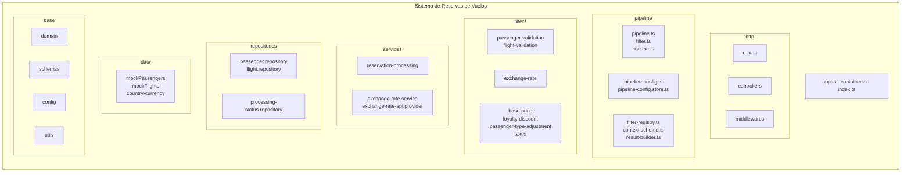
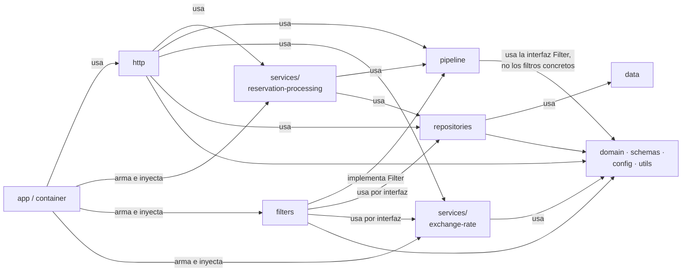
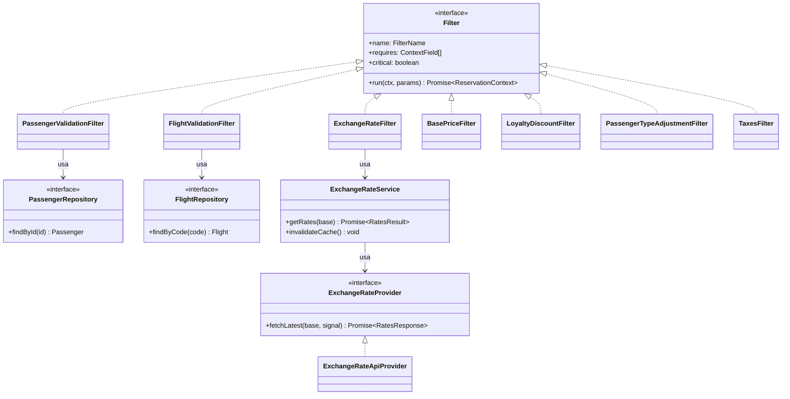

# 03. Vista de Módulos

Estilos: descomposición, usos y generalización.

La vista de componentes y conectores explica qué pasa en tiempo de ejecución. Esta vista explica cómo está dividido el código. Es la herramienta principal para razonar sobre modificabilidad y testeabilidad, que son los dos atributos que más pesan en este ejercicio: cada filtro tiene que ser independiente, poder probarse por separado y poder habilitarse o no sin tocar a los demás.

## 1. Representación primaria

### 1.1 Descomposición



### 1.2 Usos



Cada flecha significa que el módulo de origen necesita que el de destino funcione bien para funcionar él. Las flechas que no aparecen están prohibidas, y estas son las importantes:

- **Un filtro no importa a otro filtro.** Solo se comunican a través del contexto.
- **El pipeline no conoce los filtros concretos.** Los recibe ya armados desde `filter-registry.ts`, que se llena en `container.ts`.
- **Los filtros no conocen Express.** Tampoco conocen `fetch` ni la URL del proveedor.
- **El servicio de tipo de cambio no conoce el pipeline.** Se podría usar desde cualquier otra parte del sistema.

### 1.3 Generalización



Hay tres interfaces que son las que permiten probar cada filtro con dobles de prueba y cambiar el proveedor de tipo de cambio sin tocar nada más: `Filter`, `ExchangeRateProvider` y los repositorios.

### 1.4 Estructura de archivos

```text
M7A-Grupo3-Ejercicio1/
├── src/
│   ├── index.ts                       # arranca el servidor
│   ├── app.ts                         # createApp(deps): Express sin escuchar
│   ├── container.ts                   # raíz de composición: arma e inyecta todo
│   ├── config/env.ts                  # variables de entorno validadas con Zod
│   ├── domain/types.ts                # Passenger, Flight, SeatClass, PassengerType, LoyaltyTier
│   ├── data/
│   │   ├── mockPassengers.ts
│   │   ├── mockFlights.ts
│   │   └── country-currency.ts
│   ├── repositories/
│   │   ├── passenger.repository.ts
│   │   ├── flight.repository.ts
│   │   └── processing-status.repository.ts
│   ├── pipeline/
│   │   ├── filter.ts                  # interfaz Filter y helpers para rechazar o advertir
│   │   ├── context.ts                 # ReservationContext y contexto inicial
│   │   ├── context.schema.ts          # contrato que verifica el pipe
│   │   ├── pipeline.ts                # ejecución ordenada, captura de errores, traza
│   │   ├── pipeline-config.ts         # esquema y valores por defecto
│   │   ├── pipeline-config.store.ts
│   │   ├── filter-registry.ts
│   │   └── result-builder.ts          # sumidero: resultado público y moneda local
│   ├── filters/
│   │   ├── passenger-validation.filter.ts
│   │   ├── flight-validation.filter.ts
│   │   ├── exchange-rate.filter.ts
│   │   ├── base-price.filter.ts
│   │   ├── loyalty-discount.filter.ts
│   │   ├── passenger-type-adjustment.filter.ts
│   │   └── taxes.filter.ts
│   ├── services/
│   │   ├── reservation-processing.service.ts
│   │   ├── exchange-rate.service.ts   # caché, reintentos, respaldo
│   │   └── exchange-rate-api.provider.ts
│   ├── schemas/
│   │   ├── reservation.schema.ts
│   │   └── exchange-rate.schema.ts
│   ├── http/
│   │   ├── routes/
│   │   ├── controllers/
│   │   └── middlewares/               # error-handler, not-found, request-logger
│   └── utils/                         # http-error, logger, retry, money
├── tests/
│   ├── unit/filters/                  # un archivo por filtro
│   ├── unit/pipeline/
│   ├── unit/services/
│   ├── integration/                   # supertest contra createApp
│   └── helpers/                       # constructores de contexto, fetch simulado
├── postman/
├── docs/
└── README.md
```

La letra sugiere `/data/mockPassengers.ts` y `/data/mockFlights.ts`. Quedan dentro de `src/data` para que el compilador los incluya junto al resto del código.

## 2. Catálogo de elementos

| Módulo | Responsabilidad | Depende de | Qué oculta |
|---|---|---|---|
| `app`, `container`, `index` | Armar las dependencias, crear la app de Express y arrancar el servidor | Todos | Cómo se conectan las piezas |
| `config` | Leer y validar las variables de entorno | `zod` | Los nombres de las variables y sus valores por defecto |
| `domain` | Tipos del negocio | Nada | Nada, son tipos compartidos |
| `data` | Datos de prueba en memoria | `domain` | Los valores concretos de cada escenario |
| `repositories` | Acceso a pasajeros, vuelos y estados de procesamiento | `data`, `domain` | Que los datos están en arreglos y mapas en memoria |
| `pipeline` | Núcleo del patrón: interfaz de filtro, contexto, ejecución, configuración y armado del resultado | `domain`, `schemas`, `utils` | El orden de ejecución, la captura de errores y la validación entre filtros |
| `filters` | Una regla de negocio por archivo | `pipeline/filter`, `domain`, interfaces de repositorios y del servicio de tipo de cambio | La regla concreta y sus parámetros |
| `services/reservation-processing` | Procesar un lote: contextos iniciales, paralelismo, guardado y tiempo total | `pipeline`, `repositories` | Cómo se reparte el lote |
| `services/exchange-rate` | Devolver tasas sin fallar nunca | `ExchangeRateProvider`, `utils/retry`, `utils/logger` | La caché, los reintentos, el respaldo y las llamadas en curso compartidas |
| `services/exchange-rate-api.provider` | Adaptador de ExchangeRate-API | `fetch`, `schemas/exchange-rate` | La URL, el formato de la respuesta y el timeout |
| `schemas` | Esquemas Zod de entrada y de respuestas externas | `zod` | Las reglas de validación |
| `http` | Endpoints REST | `services`, `pipeline/pipeline-config.store`, `repositories` | Todo lo relacionado con HTTP |
| `utils` | Error con status HTTP, logger, reintento genérico y redondeo | Nada | Detalles técnicos transversales |

## 3. Guía de variabilidad

| Cambio esperado | Módulos que se tocan |
|---|---|
| Agregar un filtro nuevo | Un archivo nuevo en `filters`, su registro en `container.ts` y sus parámetros en `pipeline-config.ts` |
| Cambiar una regla de precio | Solo el archivo de ese filtro, o solo la configuración si es un parámetro |
| Cambiar de proveedor de tipo de cambio | Un proveedor nuevo que implemente `ExchangeRateProvider` y un cambio de una línea en `container.ts` |
| Reemplazar los datos mock por una base de datos | `repositories` y `data`. Los filtros no cambian porque usan las interfaces |
| Agregar un destino con otra moneda | `data/country-currency.ts` |

## 4. Decisiones de arquitectura

### 4.1 Justificación

- **Raíz de composición única.** Las dependencias se arman en un solo lugar, `container.ts`, en lugar de que cada módulo importe instancias globales. Así los tests pueden armar la app con un proveedor simulado o con un filtro que lanza excepciones, que es algo que piden los casos de error de la letra.
- **Se separa el servicio del proveedor de tipo de cambio.** Las reglas de resiliencia de la letra no dependen del proveedor elegido. Si se cambia de proveedor, la caché y los reintentos siguen iguales.
- **Filtros en archivos separados, uno por regla.** Así cada uno puede probarse en su propio archivo de tests, como pide la letra.
- **Referencia de estructura.** Se tomó la organización de otro proyecto de la materia, cryptoZJ: `createApp` separado de `index`, validación de entorno con Zod, errores HTTP centralizados y validación de respuestas externas. No se tomó su organización en capas como patrón principal.

### 4.2 Resultados de análisis

Para confirmar la independencia de los filtros se revisa que ningún archivo de `src/filters` importe otro archivo de `src/filters`, ni de `src/http`, ni `src/pipeline/pipeline.ts`. Es una búsqueda simple sobre los imports que se puede correr antes de cada entrega.

### 4.3 Supuestos y restricciones

- **Entorno.** Node.js 22.18 o superior, que ejecuta TypeScript directamente en desarrollo. TypeScript en modo estricto, Express 5, Zod 4, y Jest 30 con Supertest.
- **Dependencias.** No se usan librerías de HTTP ni de reintentos. `fetch`, `AbortSignal.timeout` y un reintento propio alcanzan y mantienen chico el árbol de dependencias.

## 5. Vistas relacionadas

- [02 Componentes y Conectores](02-componentes-y-conectores.md), para ver cómo estos módulos se convierten en componentes en ejecución. El mapeo está en el [índice](../README.md#mapeo-entre-vistas).
- [04 Comportamiento](04-comportamiento.md).
