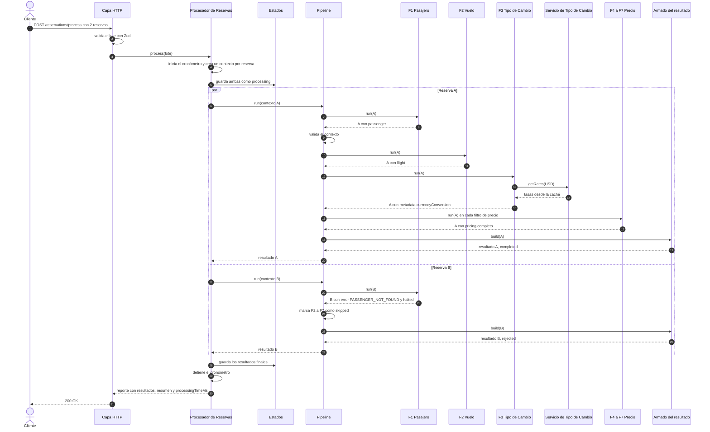
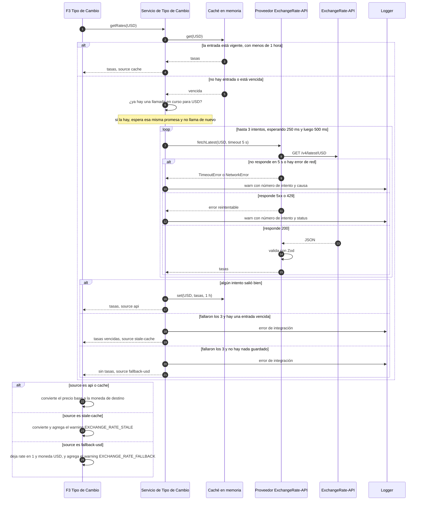
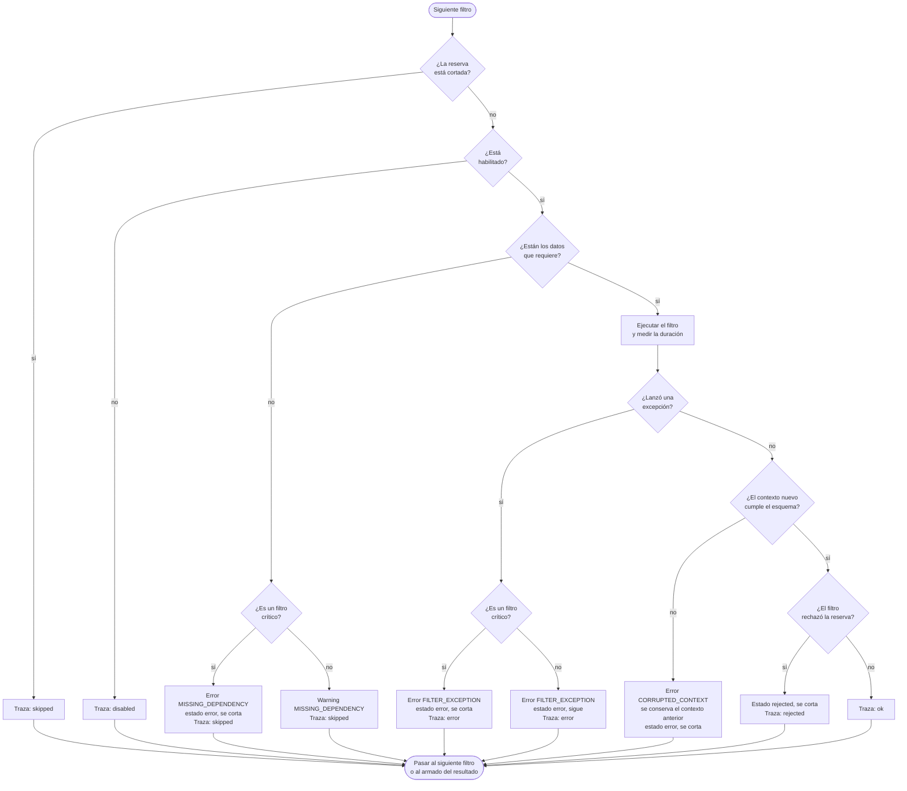

# 04. Comportamiento

Las vistas estructurales muestran qué elementos hay y cómo se conectan, pero no en qué orden interactúan. Este documento completa esa parte con notaciones orientadas a trazas: dos diagramas de secuencia y un diagrama de actividad. No pretenden cubrir todos los caminos posibles, sino los que más importan para entender el diseño y los casos de prueba de la letra.

## 1. Representación primaria

### 1.1 Procesamiento de un lote

Traza: el cliente envía dos reservas. La primera es válida y la segunda tiene un pasajero inexistente.

La respuesta es 200 aunque una reserva haya sido rechazada. El pedido HTTP salió bien, y el rechazo es parte del reporte que pide la letra.

### 1.2 Obtención de tasas de cambio

Traza: la caché está vencida y la API falla dos veces antes de responder. Los caminos alternativos muestran qué pasa si falla las tres veces.

`getRates` nunca lanza una excepción. Todo camino termina en un resultado, así que una falla de red nunca corta el pipeline, como pide la letra.

Una respuesta con estructura inválida o un 4xx distinto de 429 no se reintenta, porque volver a pedir daría el mismo resultado. En esos casos se pasa directo al respaldo.

### 1.3 Ejecución de un filtro dentro del pipeline

Diagrama de actividad de lo que hace `Pipeline.run` con cada filtro, en orden.

Los filtros críticos son los dos de validación y el de precio base. Una excepción ahí corta la reserva, porque seguir no tiene sentido si no se sabe quién viaja, en qué vuelo o cuánto cuesta. En los demás filtros la reserva sigue con el error registrado, para que el reporte muestre todo lo que sí se pudo calcular. El detalle está en el [ADR-003](../adr/ADR-003-politica-de-errores-del-pipeline.md).

## 2. Catálogo de elementos

Los participantes de los diagramas son los componentes descritos en la [vista de componentes y conectores](02-componentes-y-conectores.md#21-componentes). Solo aparecen dos elementos nuevos, que son partes internas de componentes ya descritos:

| Elemento | Parte de | Descripción |
|---|---|---|
| Caché en memoria | Servicio de Tipo de Cambio | Un `Map` con la moneda base como clave. Cada entrada guarda las tasas, la fecha informada por el proveedor y el momento en que vence. Las entradas vencidas no se borran, porque sirven de respaldo |
| Logger | Utilidades | Escribe una línea JSON por evento con nivel, mensaje y datos. En los tests está silenciado |

## 3. Guía de variabilidad

- **Timeout y cantidad de intentos.** Se cambian con `PUT /pipeline/config`, dentro de los topes de la letra.
- **Caché.** `DELETE /exchange-rates/cache` la vacía por completo, así que el siguiente pedido va a la API. Como también se borran las entradas vencidas, después de invalidar el único respaldo posible es USD.
- **Filtros críticos.** Qué filtros son críticos está fijado en el código de cada uno y no se configura.

## 4. Decisiones de arquitectura

### 4.1 Justificación

- **Una sola llamada en curso por moneda base.** Como las reservas del lote corren en paralelo, sin esta regla un lote de 50 reservas con la caché vencida haría 50 llamadas simultáneas y agotaría rápido el límite gratuito.
- **La caché vencida como respaldo.** Una tasa de hace unas horas es más útil que no convertir nada. La letra pide caer a una tasa por defecto y seguir en USD si la API falla. Se interpreta que la tasa por defecto es la última conocida y que, si no hay ninguna, se queda en USD. Ver [ADR-002](../adr/ADR-002-resiliencia-api-tipo-de-cambio.md).

### 4.2 Resultados de análisis

| Caso de la letra | Diagrama que lo cubre |
|---|---|
| Reserva válida, pasajero inexistente, vuelo sin asientos, datos malformados | 1.1 y 1.3 |
| Conversión aplicada, moneda distinta, uso de caché | 1.2, caminos de caché y de api |
| API caída, timeout, falla de red | 1.2, caminos de reintento y respaldo |
| Filtro que lanza excepción, datos corruptos a mitad del pipeline | 1.3 |

### 4.3 Supuestos y restricciones

- **Reintentos.** Hay como máximo 3 intentos en total, no 3 reintentos además del primero, y cada intento tiene su propio timeout de 5 s.

## 5. Vistas relacionadas

- [02 Componentes y Conectores](02-componentes-y-conectores.md).
- [ADR-002](../adr/ADR-002-resiliencia-api-tipo-de-cambio.md) y [ADR-003](../adr/ADR-003-politica-de-errores-del-pipeline.md).
